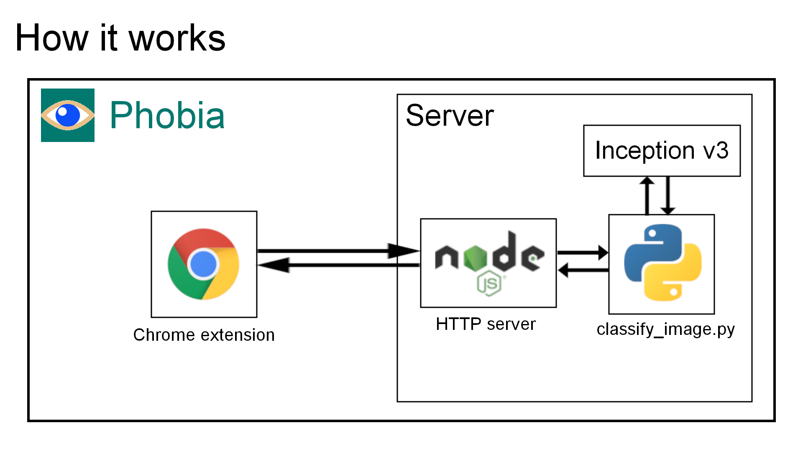

# Phobia (client side)
Phobia application will make your web browsing more comfortable by blocking images and that contain something you are afraid of.

At first, Phobia scans all the text you see. If it finds some "keywords", the image scanning is performed. All images containing something you are afraid of will be blocked.

The text scan is done on a client so it is absolutely private. Phobia does not have any databases and does not store your private data.

Phobia uses pre-trained Inception v3 model and simple image classifier.
